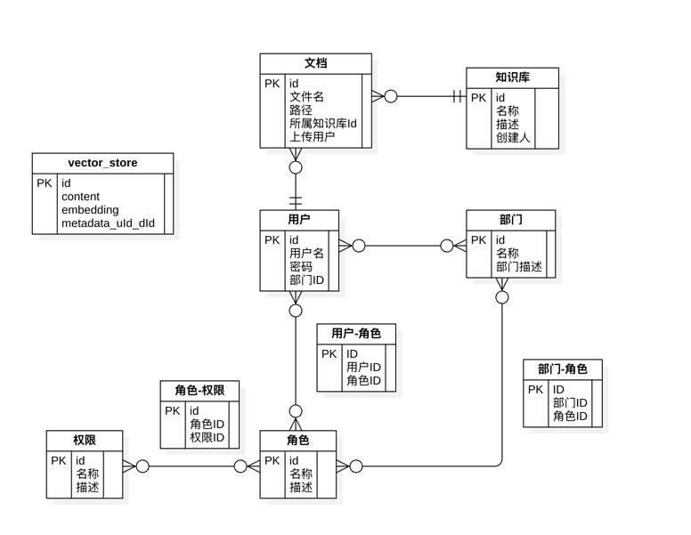
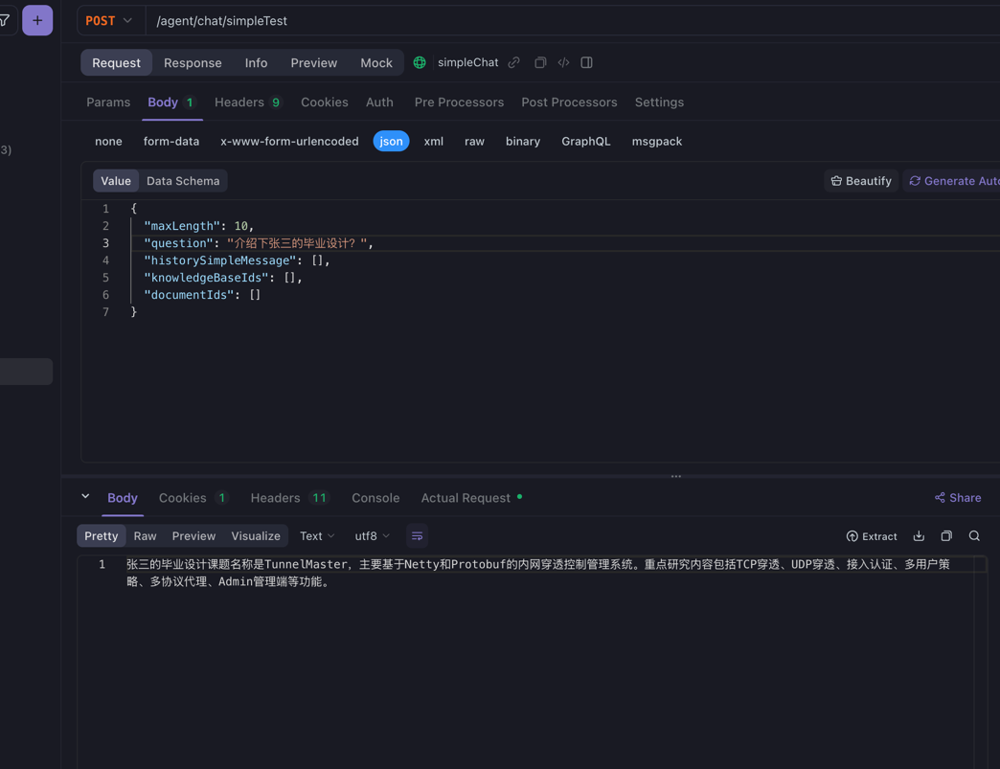
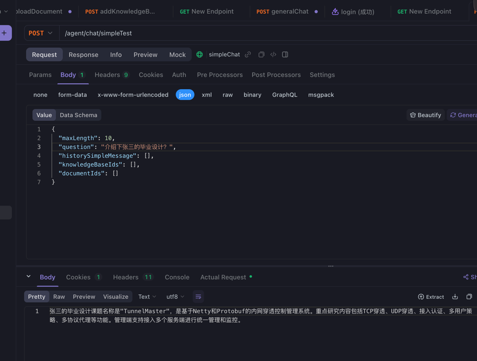
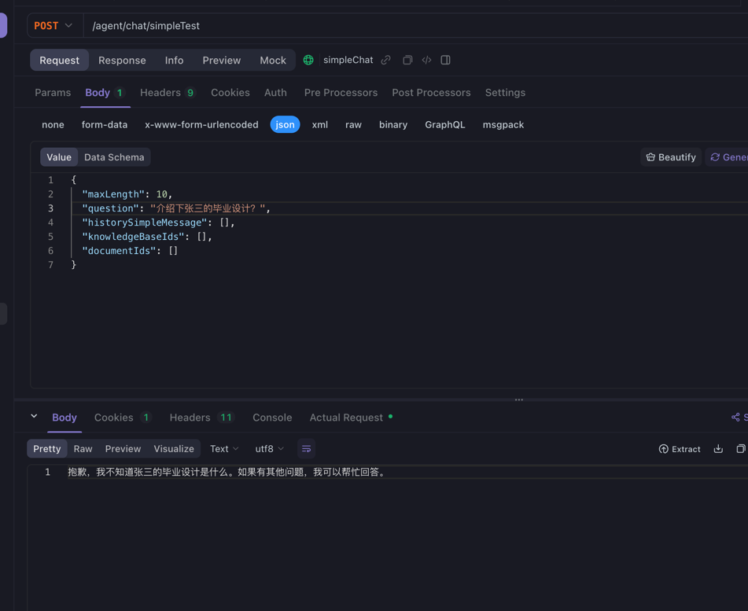

# 带权限隔离的RAG Demo(以企业部门为例)

## 对话测试

&emsp;基础文档：《张三的毕业设计》

&emsp;使用admin账号上传文档，再分别使用三个账号询问"张三的毕业设计内容"。

- 预计效果：对话的检索数据只限于自己所在部门，无法看到其它部门上传的文档

&emsp;三个用户：

| 用户        | 所在部门    | 对话情况                                  |
|-----------|---------|---------------------------------------|
| admin     | 技术部     |  |
| tech_lead | 技术部     |   |
| hr_specialist          | **人事部** |     |

## 可拓展的功能

- 指定某一个知识库进行对话
- 只针对个人上传的所有文档进行对话